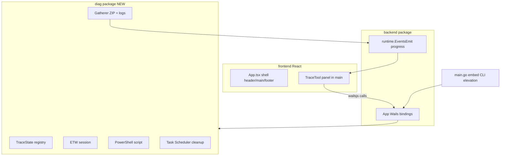

# DpDiagnosticTool → Go + React (Wails) Conversion Plan

## Source vs target

| | Source | Target |
|---|--------|--------|
| **Path** | `C:\y\w\2-web\0-dp\utils\2026,06.25.26, only DpDiagnosticTool\DpDiagnosticTool` | [`c:\y\w\2-web\0-dp\utils\to-diag-trace-go`](c:\y\w\2-web\0-dp\utils\to-diag-trace-go) |
| **Stack** | C++/WTL native dialog | Go/Wails + React/Tailwind |
| **Scope** | Windows-only DigitalPersona trace utility | Same behavior, new UI shell |

The C++ tool is a single modal dialog (`IDD_TRACEUTILDLG`) that: writes tracing registry keys, enables ETW, runs an embedded PowerShell script, auto-starts via Run key, gathers traces into a ZIP (with event logs), and optionally schedules boot cleanup via Task Scheduler. Headless modes: `/Auto`, `/DeleteFiles`.

## Target architecture

### Module layout (same `go.mod`, separate package)

Keep [`main.go`](main.go) at repo root (required for `//go:embed all:frontend/dist`).

| Package | Role |
|---------|------|
| [`backend/`](backend/) | Wails glue only: lifecycle, window/DevTools persistence ([`options.go`](backend/options.go)), thin API methods that delegate to `diag` |
| **`diag/`** (new) | All ported business logic; `//go:build windows` on every file |
| [`frontend/`](frontend/) | React UI; main content replaces placeholder in [`App.tsx`](frontend/src/components/App.tsx) lines 29–34 |

`backend` stays the Wails-bound surface; `diag` has no Wails imports so it can be tested and reused independently.

## C++ → Go file mapping

| C++ source | Go target (`diag/`) |
|------------|---------------------|
| `diagUtilities.h/.cpp` — `traceState_t`, elevation, Run key, folders | `state.go`, `elevate.go`, `runkey.go`, `paths.go` |
| `DpTracing.h` — registry schema | `registry.go` |
| `EtwUtils.h/.cpp` | `etw.go` (Win32 ETW APIs via `syscall` / `golang.org/x/sys/windows`) |
| `PsTraceUtils.h/.cpp` + `res/PowerShell.ps1` | `powershell.go` + `diag/res/PowerShell.ps1` (embed) |
| `TraceGatherer.h/.cpp` + `zip.cpp` | `gatherer.go` (`archive/zip`; event logs via `wevtutil` or `wevtapi`) |
| `TaskSchedulerStuff.h/.cpp` | `scheduler.go` (COM via `go-ole`, or `schtasks` fallback) |
| `TraceUIDlg.h/.cpp` — workflow orchestration | `service.go` (`diag.Service` coordinating start/stop/gather) |
| `main.cpp` — CLI, mutex, single-instance | [`main.go`](main.go) |

## Frontend UI plan

Reuse the existing grid shell in [`App.tsx`](frontend/src/components/App.tsx):

- **Header/footer**: blue gradient bars (already present); update title to **DigitalPersona Diagnostic Tool** / HID branding.
- **Main** (`lines 29–34`): replace placeholder with `TraceTool` component.

`TraceTool` mirrors `IDD_TRACEUTILDLG` controls from [`res/DpDiagnosticTool.rc`](C:\y\w\2-web\0-dp\utils\2026,06.25.26, only DpDiagnosticTool\DpDiagnosticTool\res\DpDiagnosticTool.rc):

1. Privacy / instruction text (3 static labels)
2. Primary **Start tracing** / **Stop tracing and Gather** button (shadcn [`button.tsx`](frontend/src/ui/shadcn/button.tsx))
3. Collapsible **More** panel: accumulate traces, Password Manager traces (disabled if PM not installed), verbosity spinbox, read-only trace folder path
4. Gather phase: progress bar, “Collecting files…”, failed-files list (hidden until errors)
5. Post-gather: Close / Start Again buttons

**Defer** C++ corner-squeeze animation initially; use Wails `runtime.WindowMinimise` or a compact “tracing active” banner instead (lower risk, same workflow).

### Frontend ↔ Go API (bound on `backend.App`)

| Method | Purpose |
|--------|---------|
| `GetTraceSettings()` | Load registry + PM detection → UI defaults |
| `StartTracing(opts)` | Registry, ETW, PS `start`, Run key |
| `StopTracingAndGather(destZip)` | ETW off, PS `stop`, spawn gatherer |
| `CancelGather()` | Cancel in-progress ZIP |
| `GetTracingActive()` | For `/Auto` and UI restore |

Events (via `runtime.EventsEmit`):

- `trace:progress` — `{ collected, total }`
- `trace:gather-done` — `{ zipPath, failedFiles }`
- `trace:gather-error` — `{ message }`
- `trace:state` — `{ isTracing }`

Use existing jotai store pattern in [`frontend/src/store/`](frontend/src/store/) for trace UI state if needed.

## `main.go` changes

1. **CLI routing** before `wails.Run` (from `main.cpp`):
   - `/DeleteFiles "path64" "path32"` → headless cleanup, no UI
   - `/Auto` → show UI only if tracing still on (minimized)
2. **Elevation**: if registry write fails, re-launch self with `runas` (same as C++ `ShellExecute`)
3. **Single instance**: Windows mutex `906BC945-EFFB-4d10-9257-D65742B131D0`; second launch signals first window via Wails `WindowShow` + `WindowFocus`
4. **Window defaults**: resize from 1200×800 to ~400×300 (dialog was 279×205); persist via existing [`IniOptions`](backend/options.go)
5. **Product metadata**: title, icon from C++ `res/` assets copied to [`build/`](build/)

## Go dependencies (add to [`go.mod`](go.mod))

- `golang.org/x/sys/windows` — registry, mutex, ETW syscalls
- `github.com/go-ole/go-ole` + `github.com/go-ole/go-ole/oleutil` — Task Scheduler COM (if not using `schtasks`)
- Standard: `archive/zip`, `embed`, `os/exec` (PowerShell, `wevtutil`)

## Phased delivery

### Phase 1 — Foundation + MVP UI
- Create `diag/` with `TraceState`, registry read/write, folder creation, PM detection
- `backend` methods: `GetTraceSettings`, `StartTracing`, `StopTracing` (registry only)
- `TraceTool` React UI with More panel and Start button wired to bindings
- Admin elevation check

### Phase 2 — Tracing subsystems
- ETW start/stop + autologger registry (`EtwUtils`)
- Embed and run `PowerShell.ps1` with `start` / `stop`
- Run-key auto-start entry
- UI tracing-active state (minimize / compact mode)

### Phase 3 — Gather + progress
- `Gatherer` goroutine: ZIP trace files, export event logs, report progress
- Wails save-file dialog for ZIP destination (`runtime.SaveFileDialog`)
- Failed-files list in UI; open Explorer on completion

### Phase 4 — Cleanup + headless modes
- `DeleteAtEnd` + Task Scheduler boot task
- `/Auto` and `/DeleteFiles` CLI paths
- Single-instance mutex
- Remove Run key and scheduled task on successful gather

### Phase 5 — Polish
- Copy icons from C++ `res/`; wire `build/appicon.png` embed in `wails.Run`
- Update README and app title (remove “wails template”)
- Manual test matrix on Windows 10/11 x64 with DigitalPersona installed

## Testing approach

- **Unit tests** in `diag/` for path logic, registry serialization, ZIP file list (mock FS)
- **Integration** on Windows VM: start → reproduce → stop → gather → verify ZIP contents match C++ tool output
- Compare registry keys and ETW session state against original `DpDiagnosticTool.exe` side-by-side

## Risks and mitigations

| Risk | Mitigation |
|------|------------|
| ETW APIs are thin in Go | Use `syscall` to `StartTrace`/`ControlTrace`; keep logic aligned with [`EtwUtils.cpp`](C:\y\w\2-web\0-dp\utils\2026,06.25.26, only DpDiagnosticTool\DpDiagnosticTool\EtwUtils.cpp) |
| Task Scheduler COM complexity | Start with `schtasks.exe` for boot task; upgrade to COM if needed |
| Large embedded PS script | Copy verbatim from `res/PowerShell.ps1`; exec with `-ExecutionPolicy Bypass` |
| Wails save dialog vs `IFileSaveDialog` | Wails `SaveFileDialog` is sufficient for ZIP pick |
| Non-Windows builds | `diag` is windows-only; `backend` stubs return errors on other OS |

## Out of scope (initial pass)

- macOS/Linux builds for diagnostic logic (tool is inherently Windows)
- Pixel-perfect recreation of WTL corner animation
- Rewriting `PowerShell.ps1` (embed as-is)
